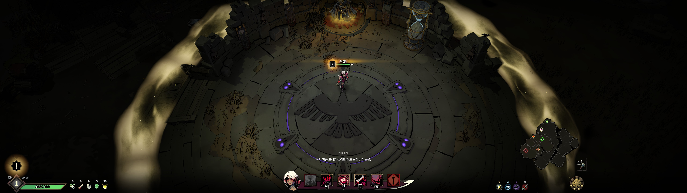
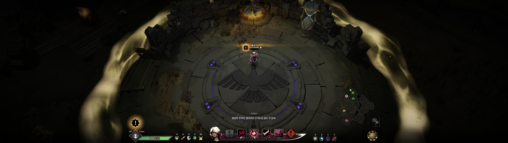
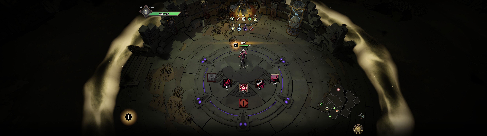
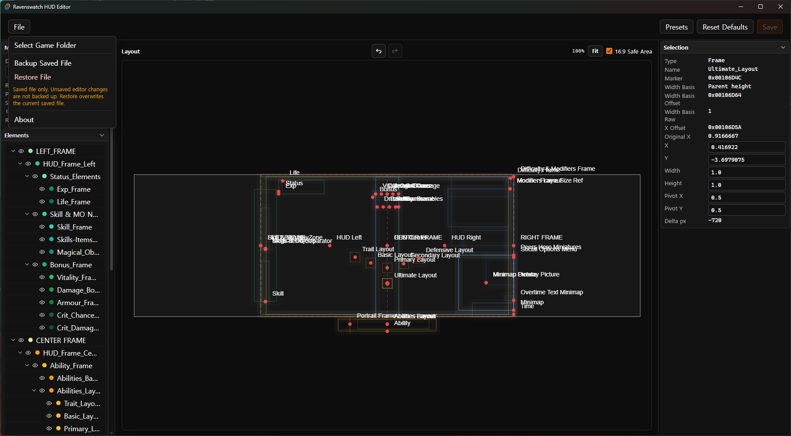

# Ravenswatch HUD Layout Editor

A visual HUD layout editor for Ravenswatch.

I made this because playing Ravenswatch on an ultrawide monitor made the left and right HUD groups too far apart to read comfortably.

## Preview

### Before



### Basic Setup (5120 x 1440)



### Custom Layout



### Editor Screen



## What This Tool Does

Ravenswatch HUD Layout Editor lets you adjust selected HUD frames and elements visually instead of editing the cooked layout file by hand.

- Drag HUD frames and elements on a monitor preview
- Apply `Basic Setup (5120 x 1440)`
- Toggle editor-only element visibility
- Preview layout against detected monitors
- Use undo and redo while editing
- Save changes back to the game layout file
- Reset supported values to known defaults
- Backup and restore the saved layout file

## Safety / Backup

This tool modifies one Ravenswatch cooked layout file:

```text
DarkTalesResources\_Cooking\MzidisFqiidzyv\Aqurqv\Aqur_Srxxrz!Aqur_Srxxrz.qzidis.ri.MzidisFqiidzyvLqvrwubq.yqz
```

With the default Steam install location, the full path is:

```text
C:\Program Files (x86)\Steam\steamapps\common\Ravenswatch\DarkTalesResources\_Cooking\MzidisFqiidzyv\Aqurqv\Aqur_Srxxrz!Aqur_Srxxrz.qzidis.ri.MzidisFqiidzyvLqvrwubq.yqz
```

If you want to make a manual backup, backing up this single file is enough.

The editor also provides built-in backup and restore actions from the `File` menu:

- `Backup Saved File`
- `Restore File`

Backups are based on the currently saved game file, not unsaved changes in the editor.

## Installation

Download the latest release and run the app.

On startup, the editor tries to detect the Ravenswatch install folder automatically. If detection fails, use `File > Select Game Folder` and select the folder that contains `Ravenswatch.exe`.

## Usage

1. Open the editor.
2. Confirm or select the Ravenswatch game folder.
3. Apply `Basic Setup (5120 x 1440)` or drag HUD elements manually.
4. Click `Save`.
5. Launch the game and check the layout.

## Presets

`Basic Setup (5120 x 1440)` moves the left and right HUD frames inward toward a centered 16:9 safe area.

More presets may be added later.

## Notes

Game updates may change the cooked layout file structure. If something looks wrong after an update, restore a backup or reset the supported values before editing again.

Use this tool at your own risk. It edits a local game resource file and is not affiliated with Ravenswatch, Passtech Games, or Nacon.

## Development

This app is built with Tauri, React, TypeScript, Vite, and react-konva.

```powershell
npm install
npm run dev
```

Useful scripts:

```powershell
npm run dev
npm run dev:web
npm run check:frontend
npm run build
```

## License

MIT License.

You are free to use, modify, and redistribute this project, but please keep the original copyright and license notice.
